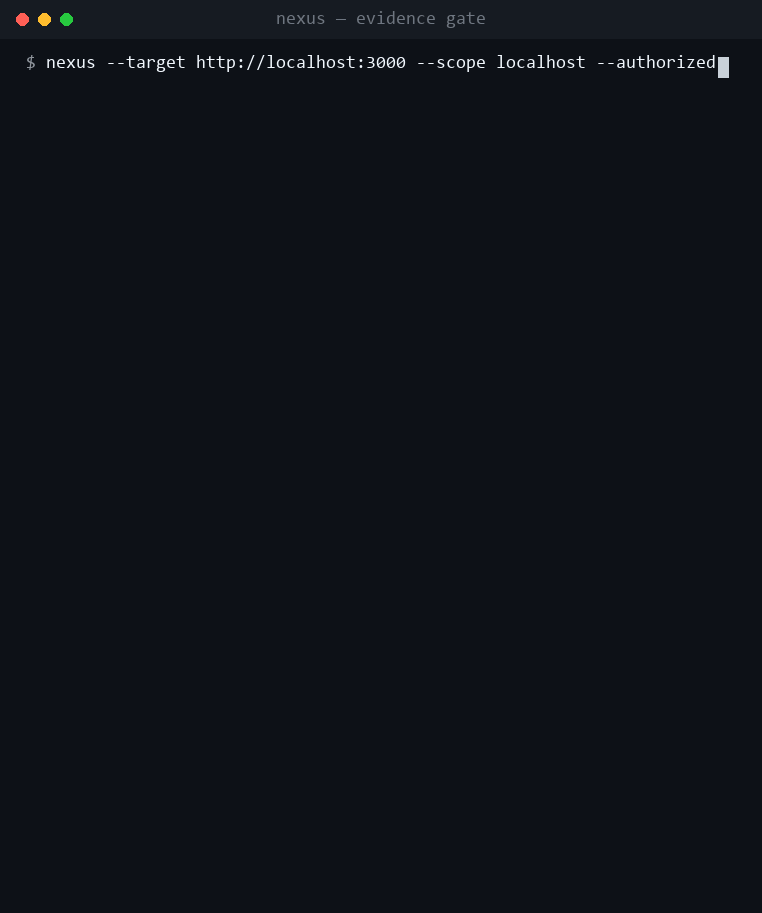

# Nexus

**An autonomous security assessor for systems you own or are authorized to test.**

[](https://pypi.org/project/nexus-sec/)
[](https://pypi.org/project/nexus-sec/)
[](LICENSE)
[](#)
[](#)

> Probe like an attacker, report like a defender — and **every finding is proven by a
> response the target actually gave**. No hallucinated vulns, whatever model drives it.
> `pip install nexus-sec`

<p align="center">
  
</p>

<p align="center"><sub>The model claimed <b>5</b> vulnerabilities. Nexus reported the <b>one</b> the target's own response proved — the other four (a fabricated AWS key, a "user-database dump" the server answered <code>401</code> to, an untested TLS claim, an unobserved stack trace) can't reach the report. Not filtered afterward — structurally excluded. Reproduce: <code>python lab/evidence_gate_demo.py</code></sub></p>

Nexus reasons like an attacker (recon → enumerate → probe for real weaknesses) and
reports like a defender (severity, evidence, concrete remediation) — and it acts **only
inside an authorized scope you declare up front**. It is a tool for assessing *your own*
infrastructure and engagements you have written permission for. It is **not** a service
for attacking third parties.

The brain is a capable model driving a tool-use loop over real security tooling. The
built-in probes are pure stdlib, so the core runs in a minimal or air-gapped box.

---

## What makes it different: the evidence gate

Every LLM confabulates under pressure. Point *any* model — a small local one or a
frontier one — at a target and ask it to "write the security report", and it will pad the
report with plausible findings it never actually confirmed: an imagined TLS weakness, a
fabricated exposed-secret, a "likely" SQL injection. **For a security tool, a fabricated
finding is the worst possible output.**

Nexus splits the two jobs the model is good and bad at:

- the model **probes** — it decides what to test and fires the payloads (it's good at this);
- a deterministic **evidence gate** (`findings.py`) **writes the report** — and it credits a
  finding **only when the live target's own response proves it**: the XSS marker reflected
  back unescaped, `/etc/passwd` contents returned on a traversal, a SQL error on a quote, a
  server issuing a token for `' OR 1=1--`.

Nothing in the authoritative report comes from the model's prose. The result is a report
where **every finding is backed by a real response the target actually gave** — fabrication
is structurally impossible, not merely discouraged.

```console
$ nexus --target demo.testfire.net --authorized --rules-accepted

[scope]  allowlist: demo.testfire.net · external → throttle 1.0s
[scope]  ✓ authorized   ✓ program-rules attested
→ crawl()            found /search.jsp /login.jsp /index.jsp
→ fuzz_params()      47 params across 6 endpoints
  ↳ /search.jsp?query=<script>alert(1)</script>
     ✓ reflected UNESCAPED — XSS confirmed
  ↳ /index.jsp?content=../../../../etc/passwd
     · no root:x: in body — not confirmed, dropped
→ security_headers() ✓ no CSP / HSTS — confirmed

[gate]  writing report from EVIDENCE, not prose
  ✗ "weak TLS 1.0 cipher"        no evidence · DROPPED
  ✗ "creds in /config.bak"       no evidence · DROPPED
  ✓ HIGH    Reflected XSS   /search.jsp?query=
  ✓ MEDIUM  Missing CSP/HSTS
  ✓ INFO    Server: Apache-Coyote/1.1

[done]  3 findings · 0 fabricated · evidence-gated
```

The model *suspected* a traversal and a couple of other issues; the gate **dropped every
one the target didn't actually confirm**. That's the whole product.

## Proof (live, evidence-gated)

- **Real external target** — against IBM's public, sanctioned-for-scanning AltoroMutual
  demo bank (`demo.testfire.net`), Nexus autonomously enumerated the app and confirmed a
  **Reflected XSS (High)** on `/search.jsp?query=` (marker reflected unescaped), alongside
  server-version disclosure and missing CSP/HSTS — all live-confirmed, zero fabricated
  findings.
- **OWASP Juice Shop** — full pass across the exercised vulnerability classes (SQLi
  auth-bypass → broken access control), reproduced deterministically.

## Ethics & authorization — the core, not a footnote

Nexus is built to be used **only against systems you are authorized to test**.

- **Scope is an explicit allowlist** you provide at launch (`scope.py`). Every tool
  re-checks the scope before touching a target, and re-checks **every redirect hop** (an
  in-scope target that 302s to cloud metadata or loopback is refused — SSRF guard). Out of
  scope = hard refuse, enforced in code, not left to the model's goodwill.
- **`--authorized` is required** to start — it attests you have explicit permission.
- **External targets require a second gate.** If the target resolves to a public-internet
  address, Nexus refuses until you pass `--rules-accepted` — attesting that active,
  *automated* testing is permitted by that target's program rules — and it applies a
  politeness throttle so a live service is never hammered.
- **No destructive or denial-of-service actions.** The agent assesses through safe,
  read-leaning means; the system prompt and tool allowlist forbid damage/DoS.

Using this against systems you don't own or have written permission to test is illegal.
Don't.

## Install

```bash
pip install nexus-sec           # core is stdlib — zero runtime deps
pip install "nexus-sec[tui]"    # optional: the full-screen interactive console
```

Then just run:

```bash
nexus
```

## The interactive console

Run `nexus` with no arguments and you get a **full-screen console** — a pinned input box, a
scrolling conversation above it, a live status line — the shape of a modern agent CLI:

- **Type a target** (`example.com`, `127.0.0.1:8080`) → it runs an authorized assessment,
  streaming each tool call and the agent's live reasoning, then a colour-coded findings panel.
- **Ask a question** (`what is broken access control?`) → it answers like an AI assistant,
  with a live "thinking" view as the reply forms.
- **Slash commands** with live hints (type `/` to see them, `Tab` to complete): `/model`
  (switch brain/model, with a picker), `/key` (set your Anthropic API key, hidden), `/format`
  (report as `md` · `sarif` · `json`), `/scope`, `/report` (render the last report),
  `/defend` · `/guard` · `/estate` (defend a host/estate you own — read-only posture, proposals
  only), `/clear`, `/help`, `/quit`. Recall past inputs with `↑`/`↓`; press `Esc` to stop a run.
- On first run it **starts the local Ollama server for you** and pulls a free default model —
  zero setup. Pick a frontier brain any time with `/model` → Claude, then paste your key inline.

Prefer scripting? The one-shot flag form works too:

## Use

```bash
# assess a system you own (loopback/lab — no external gate needed):
nexus --target 127.0.0.1:8080 --scope 127.0.0.1 --authorized

# an authorized external engagement (bug-bounty / VDP / written scope):
nexus --target app.example.com --authorized --rules-accepted \
        --rate-limit 2 --objective "Assess the login flow and TLS posture."

# emit SARIF for GitHub code-scanning / CI (or --format json for a raw feed):
nexus --target 127.0.0.1:8080 --scope 127.0.0.1 --authorized --format sarif

# a client-ready deliverable (executive summary, CVSS, attack paths) — print to PDF from a browser:
nexus --target 127.0.0.1:8080 --scope 127.0.0.1 --authorized \
        --format html --client "BluePeak Ltd" --vendor "Acme Offensive Security"
```

Without `--authorized` it refuses to run. Against a public-internet target it also refuses
without `--rules-accepted`. The report is **evidence-gated by default**; add
`--trust-model-report` to see the model's raw (unverified) prose instead.

`--format sarif` writes a standard **SARIF 2.1.0** file (same evidence, machine-readable) that
GitHub Security, VS Code, and CI pipelines ingest directly; `--format json` gives a plain
structured feed. The output file extension follows the format.

### The client deliverable (`--format html`)

`--format html` turns the same evidence-gated findings into a **document you can hand a client** —
a branded, self-contained HTML report (no external assets; open it and *Print → Save as PDF*).
It adds what a raw finding list doesn't:

- an **executive summary** in plain language for a non-technical reader;
- a computed **CVSS 3.1** base score + vector on every finding (the real formula, not a guess);
- **attack paths** — the narrative of how separate weaknesses *combine* into a breach (e.g.
  *arbitrary file read → harvest the leaked secret → authenticate*), the story a scanner's flat
  list never tells;
- a **compliance mapping** — every finding tied to its **CWE**, **OWASP Top 10 (2021)** category,
  and the closest **PCI DSS v4.0** requirement, so the report doubles as an audit artefact for a
  SOC 2 / ISO 27001 / PCI client.

Every line still comes from the evidence gate — CVSS is computed from a fixed vector per class and
an attack chain is only asserted when **both** of its findings were actually confirmed, so the
prettier document is no less honest than the raw report. Because it renders **offline**, the whole
report — including the AI-written prose — can be produced on client data you are contractually
forbidden to send to a cloud AI. Brand it with `--client` / `--vendor`.

### Retest / delta (`nexus retest`)

An engagement doesn't end at the first report — the client remediates and you **retest** to prove
the fixes landed. Save each run's findings (`--format json`) and diff them:

```bash
nexus --target app.example.com --authorized --rules-accepted --format json --report run1.json
# … client remediates …
nexus --target app.example.com --authorized --rules-accepted --format json --report run2.json

nexus retest run1.json run2.json                       # fixed / still-open / new, in the terminal
nexus retest run1.json run2.json --format html \
        --client "BluePeak Ltd" --vendor "Acme Security"   # a branded retest deliverable
```

It matches findings by class + location and reports each as **fixed**, **still open**, or **new**,
with a remediation rate (e.g. *2 of 3 prior findings remediated (67%)*) — the proof-of-remediation
artefact a retest is paid to produce. Fully offline; nothing is inferred.

### Remediation plan (`nexus fixes`)

A finding list tells a client *what* is wrong; a senior report tells them *what to do Monday
morning*. From a saved report, `nexus fixes` emits a **prioritised roadmap** — findings grouped
into *Immediate / Short-term / Hygiene* by real CVSS risk — plus a **copy-paste fix per finding
class** (a parameterised query, a strict CSP, a path-canonicalisation guard, an nginx deny rule):

```bash
nexus --target app.example.com --authorized --rules-accepted --format json --report run.json
nexus fixes run.json                          # the phased plan + code, in the terminal
nexus fixes run.json --report plan.md         # …or written to a Markdown fix-pack
```

The same plan and fixes ride inside the `--format html` deliverable. Every fix is a deterministic,
curated projection over the evidence-gated findings — no model-authored prose, so the remediation
is exactly as trustworthy as the findings it answers. A live leaked credential is always flagged
*Immediate*, regardless of score.

### Ask the co-pilot (`nexus ask`)

Once you have a saved report, **interrogate it in plain language** — the report becomes an
interactive consultation:

```bash
nexus --target app.example.com --authorized --rules-accepted --format json --report run.json

nexus ask run.json "what do I fix first?"
nexus ask run.json "how do these chain together?"
nexus ask run.json "explain the exposed secrets"
nexus ask run.json "draft a client summary email"
```

Answers are **deterministic and grounded only in the confirmed findings** (reusing the same CVSS /
attack-path / compliance / fix projections). That is deliberate: the moat is *never fabricate*, so
the co-pilot cannot invent a finding the target didn't confirm. Ask it to *"explain the SQLi"* when
no SQL injection was found and it tells you there's no evidence for one — rather than making one up.
Offline; no model call. `nexus ask run.json` with no question lists what it can answer.

## Free vs Pro

Nexus is source-available (BUSL-1.1) and **free to evaluate** — run the full evidence-gated engine
against your own local / lab targets. The **Pro** tier is for commercial consulting work.

| | Free (community) | Pro |
|---|---|---|
| Evidence-gated assessment | ✓ local / lab targets | ✓ **+ external / public-internet targets** |
| Findings — Markdown / JSON / SARIF | ✓ | ✓ |
| Client deliverable (`--format html`) | watermarked (evaluation) | ✓ **un-watermarked, brandable** |
| Co-pilot — `nexus ask` | — | ✓ |
| Retest / delta — `nexus retest` | — | ✓ |
| Remediation plan — `nexus fixes` | — | ✓ |
| Compliance mapping (CWE / OWASP / PCI) | — | ✓ |
| Tuned offline defender model | — | ✓ |

Commercial use — assessing external targets or handing a client an un-watermarked report — requires a
Pro licence: `nexus license add <token>`. (This is an honour-based, source-available model: the code
is open, so the licence is legal + the tuned model weights ship only to licensees — not DRM.)

## The Pro model — the actual paid value

For **offline / confidential** work — where you can't send a client's data to a cloud model —
your free option is a *generic* local model. On real assessment, a generic 1.5B is close to
useless: in a held-out benchmark it stayed pinned at two passive findings per run and **never
actually exploited anything**.

Nexus Pro ships a **security-tuned model** — same size, same offline box, but trained (on its own
teacher-distilled trajectories, under an evidence scorer where fabrication is impossible) to
*actively test and confirm* vulnerabilities:

| offline brain | recall — held-out (N=12) | recall — OOD, unseen app | fabricated |
|---|:---:|:---:|:---:|
| generic 1.5B (the free local option) | 35% | 28% | 0 |
| **Nexus Pro tuned model** | **95%** | **71%** | 0 |

- **Fabrication is impossible** — a finding counts only if the live server's response confirms it;
  `fp=0` on both arms. Neither brain hallucinates — the tuned one just *finds more real bugs*.
- **OOD** — the 71% is on a *different* deliverable app it never trained on. Generalization, not
  memorization.
- **Reproducible & deterministic** — greedy decode, bit-for-bit: `python lab/ood_eval.py base devportal`
  vs `python lab/ood_eval.py <adapter> devportal`.

That's the paid value in one line: **not a code unlock (the code is open) — the offline brain that
actually does the job**, plus ongoing retrains and commercial-use rights. The weights aren't in this
repo; they ship, sealed, only to licensees.

## Choose your brain

Nexus is model-agnostic — the same tool-use loop runs on any of three brains:

| `--brain` | what it is | when |
|-----------|------------|------|
| `claude` (default) | Claude Messages API | strongest reasoning; needs an API key |
| `ollama` | a local Ollama server (e.g. `qwen2.5:7b`) | fully local, no API key |
| `local`  | an offline HF student model | air-gapped boxes; `pip install nexus-sec[local]` |

Because the evidence gate — not the model's eloquence — is what makes the report
trustworthy, even a small local brain produces a report free of fabricated findings.

## Coverage

- **Custom parametric fuzzing** (`fuzz_params`) — crawls the app (forms, JS-built URLs,
  and, with the optional `[spa]` extra, JavaScript-rendered single-page apps), enumerates
  every parameter, and live-confirms reflected-XSS / path-traversal / SQL-injection with
  zero false positives.
- **Mature-scanner orchestration** (`nuclei`) — thousands of templates for known
  CVEs / exposures / misconfigurations, with each match passed through the same evidence
  gate. The two complement each other: `nuclei` knows the *known*, `fuzz_params` finds the
  *custom* app logic no template covers.
- **Blue-team posture** — security-header grading, version-disclosure, TLS checks.

## Defend from within

Nexus doesn't only attack — it can **attach to a system you own and defend it from the inside**.
The same evidence gate that makes the pentest report fabrication-proof grades the defensive
posture, and a deterministic diff turns a one-shot check into continuous defence: what's **new**,
what's **still open**, and what's been **fixed** since the last patrol.

```bash
# one-shot: read-only posture of THIS host + an AI triage brief + fix PROPOSALS
nexus --defend --authorized

# continuous guardian: cheap deterministic sweeps on a timer; the AI brain engages ONLY when a
# NEW hole appears — the quiet tiers stay free, the model is spent only where it earns its keep
nexus --guard --authorized --interval 300

# defend a whole estate (hosts + web services) declared in a config, rolled into one posture
nexus --estate assets.json --authorized --interval 300
```

Inside the interactive console the same capability is `/defend`, `/guard`, and `/estate`.

It inspects, read-only: network-exposed sensitive services (RDP/SMB/WinRM/…), whether endpoint
protection and the host firewall are actually on, and hijackable (unquoted) service paths — each
reported **only** on a concrete, evidence-backed bad condition (zero false positives; a healthy
setting produces nothing). For every open finding it proposes an **exact, reversible** fix with its
verify + rollback and a risk grade.

**Proposals only — nothing is ever applied automatically.** Detection and triage never change the
system; applying a fix is a separate, explicit, confirm-first step
(`python -m redblue.blue --apply <finding> --yes`), so the defender can never surprise a live box.

## Architecture

| module | role |
|--------|------|
| `scope.py`    | authorization core — hostname-suffix + IP/CIDR matching + redirect-hop SSRF guard; the ethical line |
| `findings.py` | the **evidence gate** — derives the report from real tool results, never from model prose |
| `llm.py` / `local.py` / `hf_local.py` | model-agnostic brain seam (Claude / Ollama / offline student) |
| `tools.py`    | scope-gated hands: DNS / HTTP / port-scan / TLS + parametric fuzzer + allowlisted binaries (nmap, nuclei, ffuf, ...) |
| `agent.py`    | the autonomous tool-use loop + red+blue system prompt |
| `sentinel.py` | defender diff engine — deterministic sweeps graded by the evidence gate, diffed new / still-open / fixed; asset-agnostic |
| `host.py`     | attach from the **inside** — read-only host posture (exposed services, Defender/firewall, hijackable paths) |
| `estate.py`   | defend a whole estate — many hosts + web services rolled into one posture with what changed |
| `blue.py`     | the defender's **brain** — triage / risk / attack-chains + the two-tier autonomous guardian (read-only) |
| `remediate.py`| a finding → an exact, reversible fix **proposal** (verify + rollback + risk); applying stays confirm-first |
| `cli.py`      | launch + the `--authorized` / external `--rules-accepted` gates + interactive REPL |
| `tui.py` / `tui_app.py` | the optional rich / full-screen (Textual) interactive console — presentation only |

## Status

Real and working: the loop, scope gate, evidence gate, parametric fuzzer, SPA rendering,
nuclei orchestration, external-target preflight, the interactive full-screen console, the
AI-assistant chat mode, and the **defender** (host/estate posture, the two-tier guardian, and
confirm-first remediation) all work and are covered by 285 tests. Proven end-to-end on a live
external target, on OWASP Juice Shop, and — locally, driving the console with a free Ollama
model — finding real path-traversal and reflected-XSS with zero fabricated findings.

## Try it in 60 seconds

```bash
pip install nexus-sec
nexus --target 127.0.0.1:8080 --scope 127.0.0.1 --authorized   # a lab box you own
```

No API key needed — on first run `nexus` starts a local Ollama model for you. Point it at a
target you own or have written permission to test, and read a report where every finding is
backed by a response the target actually gave.

## Feedback & design partners

Nexus is early, and I want it pressure-tested by people who do this for a living. The most
useful feedback: where the **evidence gate** is *too strict* — a real bug it refused to credit
because the target's response didn't prove it cleanly — or a class of weakness it structurally
can't see. That trade-off (false negatives over fabrication) is deliberate, but I want to map
exactly where it costs you.

If you're a solo pentester or a small shop and this fits how you work, I'm looking for a few
**design partners** — early users who shape where it goes. Open an issue:
**https://github.com/alerta200/alerta/issues**
